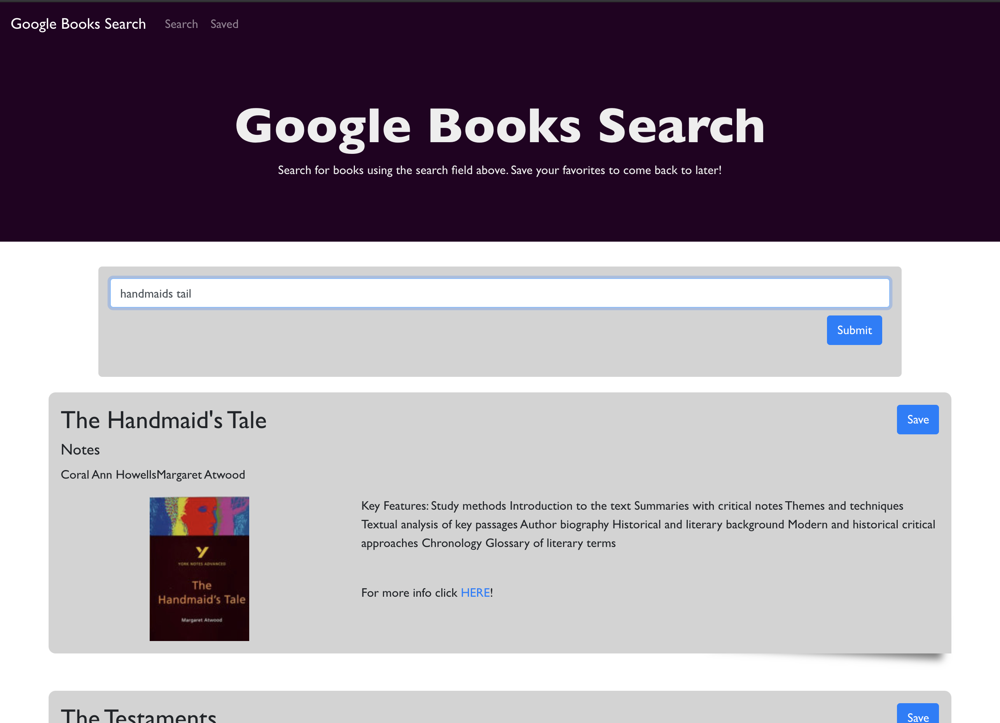

# Google Books Search

## Description: 
This application uses React JS and Mongoose, allowing a user to search the Google Books API, and save any results to a list that is displayed on the 'Saved' page. The user can also delete books from this list giving the app CR_D functionality. 

## Usage: 
Visit the deployed app [HERE](https://pacific-earth-75465.herokuapp.com/)!

## Build Tools:
* [React JS](https://reactjs.org)
* [React-Bootstrap](https://react-bootstrap.github.io)
* [Mongoose DB](https://mongoosejs.com)
* [Node JS](https://nodejs.org/en/)
* [Express JS](http://expressjs.com/)
* [axios](https://www.npmjs.com/package/axios)
* [cors](https://www.npmjs.com/package/cors)
* [Google Books API](https://books.google.com/?hl=en)

## Contributing:

## Questions:
* GitHub Profile:  [the-medium-place](https://github.com/the-medium-place)
* Email: <zgstowell@gmail.com>

